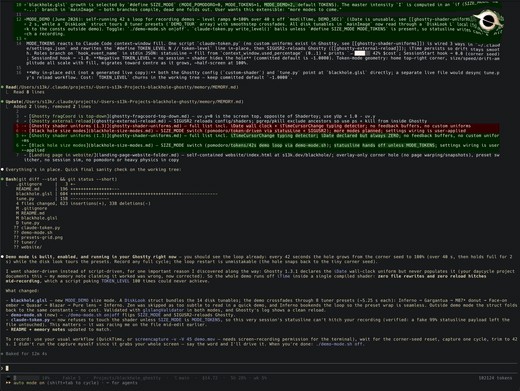

# DevChaos — The 7 Dwarfs of Prompt Engineering

Pixel dwarfs live on your screen, react to detected IDE prompts when listening is enabled,
roast your prompts in written Lebanese Arabizi with game-gibberish audio — and a real gravitational-lens black hole eats your screen when
it's time to rest.

Built for the **Zaka LB FunChallenge 2026** (Functionality · Creativity · Fun · Demo).


## Meet the dwarfs

| Doc | Grumpy | Happy | Sleepy | Sneezy | Bashful | Dopey |
| :---: | :---: | :---: | :---: | :---: | :---: | :---: |
|  |  |  |  |  |  |  |

## Black-hole  



## What it does

- **7 dwarf personas, one fair scoring brain.** Doc teaches, Grumpy destroys, Happy hypes
  garbage, Sleepy owns the black hole, Sneezy sneezes without changing your input,
  Bashful whispers his critique, Dopey answers the wrong question thrilled.
  Every dwarf grades the exact original IDE prompt using the same deterministic engine.
- **Normal dwarf chat.** The dialogue input is for conversation in Lebanese Arabizi,
  not prompt grading — even if you type “fix it”. No score cards, prompt statistics,
  quality streaks or automatic rewrites. Each dwarf remembers up to ten recent chat
  messages in memory for follow-ups; this history resets when the app reloads.
- **🎧 IDE listener (the magic).** Toggle the headphones and the dwarf reacts to detected prompts
  you type to your real AI agent (VS Code, Zed, Cursor, ZCode, Claude Code, browser AI
  chats). Type once — the dwarf reacts automatically. Code lines, URLs and terminal
  commands are filtered; Shift+Enter stays inside the message. Opt-in with a visible
  indicator. Accepted prompts enter local session history; see the privacy notes below.
- **The black hole.** When your work timer expires (3 hours on a fresh profile, with a 30-minute break), a
  gravitational-lens shader over a capture of your real screen spawns at a random spot,
  grows, tumbles in 3D, devours the screen, then recedes while you rest.
- **Roastometer** — slide between WHOLESOME and SAVAGE to set the next roast's intensity.
  Full savage puts sunglasses on the dwarf.
- **Living creatures** — per-dwarf motion personalities, idle quips, AFK naps,
  storms-off-after-3-lazy-prompts (Dopey replaces Grumpy), mood meter (your prompt
  quality is his diet), drag-and-drop, Leaderboard of Shame.
- **Game-gibberish voice + 8-bit SFX** synthesized in Web Audio — zero audio files,
  zero TTS, works with the sound off.

## Quick start

```sh
npm install          # on CDN-blocked networks: ELECTRON_MIRROR=https://npmmirror.com/mirrors/electron/ npm install
npm start            # overlay appears, dwarf starts walking
```

Controls:

| Action | How |
| --- | --- |
| Toggle 🎧 IDE listening | the `🎧 IDE` chip (top-right) or **Ctrl+Alt+L** |
| Summon the black hole | the `☠` chip (top-right) |
| Switch dwarf | colored dwarf chip in the dialogue header (cycles through all seven) |
| Roastometer | slider inside the dialogue panel |
| Quit | **Ctrl+Alt+Q** or tray menu |

Settings live in `%APPDATA%/devchaos/config.json` (break length, demo mode, listen state).
API keys are pasted into the app's own settings — never into the repo.

## Demo mode

`npm run demo` — fast timings (10s hole growth + 10s recession) for rehearsals. The tray menu also has a
demo toggle and "Summon black hole".

## Architecture

```
src/main/       Electron main: overlay + break windows, tray, IPC, IDE listener host,
                gates (IDE window match + natural-language filter), config/session
src/renderer/   overlay UI (dwarf engine, dialogue panel, selector, hole canvas), break window,
                hole.js — the overlay-native black hole engine (transparent WebGL2 +
                alpha mask so the lens floats over your real work)
src/brain/      scorer.js (deterministic <100ms), personalities, canned roasts + Lebanese
                lines, memory/mood, LLM adapter (Gemini / DeepSeek / OpenRouter; bounded fallback)
src/audio/      blip-voice synth (per-dwarf waveforms), jsfxr SFX presets
src/shaders/    blackhole port (geodesic-traced, live disk inclination/roll uniforms)
tools/          art pipeline (cutout/classify), ide-listener.ps1 (keyboard hook),
                standalone shader rig
tests/          node:test suites (scorer calibration, banks, memory, gates)
```

IDE path: `original IDE prompt → scorer → score card, mood, memory, triggers → roast + Doc refactor`.
Chat path: `manual message + bounded per-dwarf chat history → conversational reply`.
Routing depends on where the input came from, not what its words look like.
IDE grading may include an English rewrite of the original prompt. There is no
DOC, HELP ME button. The Roastometer controls IDE roasts, not ordinary chat.

**Offline-first grading:** rule scorer + canned roasts remain local. Normal chat has
simple local greetings and acknowledgements; other questions show an honest offline
notice rather than a roast or an invented answer. Full conversation needs the selected
Gemini, DeepSeek direct, or OpenRouter provider. Chat replies appear immediately after the provider returns,
without waiting for the panel's roast typewriter animation.

**Dialogue:** the main overlay uses Lebanese Arabizi for dwarf replies, including
primary offline roasts, idle quips and entrances. Model prompts require whole-roast
Arabizi rather than English with a greeting. Copy-ready model rewrites remain English;
offline templates preserve the original input and append English guidance. Audio is
still game-gibberish, not spoken Arabic. Native-speaker taste approval is pending;
see [samples and verification limits](docs/LEBANESE_TASTE_CHECK.md). The legacy separate
break-window fallback retains its old English text.

## Providers and connection checks

Settings offers Gemini Flash, DeepSeek direct, and two OpenRouter models:
DeepSeek V4.1 Flash and Union Alpha (`stealth/union-alpha`). Selection is explicit:
there is no automatic provider failover. Switching OpenRouter models keeps the saved
OpenRouter key; switching providers requires that provider's key. Save before testing.

**TEST ROAST tests one roast using saved settings.** Its success is not a persistent
online indicator and does not test the different chat request. Requests have a 30-second
full-response deadline; Union Alpha chat gets 45 seconds. Receiving HTTP headers does
not mean the response body has finished. A slow body can still time out.

If chat reports offline, read the reason (quota, key, model, timeout, network, or response).
The saved key is not erased by a failed request. The password field stays empty for
privacy. Provider availability is not guaranteed; local grading and canned roasts stay
available. Inputs are processed sequentially, so queued chat can wait behind IDE requests.

## Tests

```sh
npm test                 # scorer, content, cache, persistence, listener lifecycle, contracts
node src/main/gates.cjs  # IDE-window and natural-language gate unit checks
npm run test:listener    # Windows: compile hook class; synthetic context tests, no live capture
npm run test:smoke       # Electron installed: isolated profile, mocked provider, listener off
```

## Privacy (the honest version)

The listener is Windows-only and starts disabled on a fresh profile. Your listening
preference is restored on later launches. While enabled, the keyboard hook buffers
keystrokes globally in RAM; main applies the window and natural-language gates after
Enter. The buffer is discarded on foreground-window changes and observed title changes.
This is a heuristic, not a guarantee that every AI prompt is detected or every sensitive
field is excluded. Synthetic tests cover reset logic, not live Windows event delivery.

Accepted IDE prompts enter local prompt history and are persisted in `session.json`
under Electron's user-data directory. Manual conversation does not enter that history;
its bounded per-dwarf history is held only in renderer memory. Existing saved history
from older versions is not removed. Gate diagnostics omit captured text and window
metadata. Older logs from earlier versions are not scrubbed.
When an API key is configured, accepted IDE prompts and a session summary may be sent
to the selected provider. Manual chat sends the current message and up to ten previous
chat messages for that dwarf (each history entry capped at 1,000 characters); IDE
prompt history is not included in chat requests. Disable listening for sensitive work,
avoid sensitive chat messages, or keep the app offline without a key. Keys are stored in local plaintext configuration, not encrypted; the
settings UI masks saved keys and never returns their value to the renderer.

The screen capture used for the black hole is processed locally. Do not commit
user-data, session files, credentials, or diagnostic screenshots.

## Credits & licenses

MIT — see [LICENSE](LICENSE). The black hole shader core and window patterns are adapted
from **blackhole-timer** (MIT) / **ghostty-blackhole** (MIT); SFX from **jsfxr**
(public domain); vague-prompt regexes inspired by **Promptlinter** (MIT). Full texts in
[THIRD-PARTY-LICENSES.md](THIRD-PARTY-LICENSES.md). Dwarf art generated by the author.
